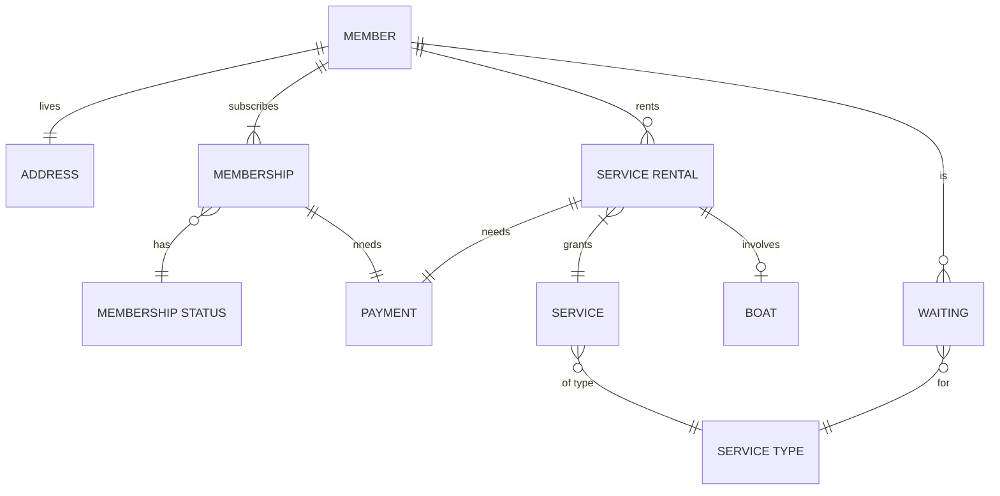

# Database Schema for Circolo Nautico Cattolica

## 1. Database Diagram

```mermaid
erDiagram
    MEMBER ||--|| ADDRESS: lives
    MEMBER ||--|{ MEMBERSHIP: subscribes
    MEMBERSHIP }o--|| "MEMBERSHIP STATUS": has
    MEMBER ||--o{ "SERVICE RENTAL": rents
    "SERVICE RENTAL" ||--|| PAYMENT: needs
    MEMBERSHIP ||--|| PAYMENT: nneds
    "SERVICE RENTAL" }|--|| SERVICE: grants
    "SERVICE RENTAL" ||--o| BOAT: involves
    SERVICE }o--|| "SERVICE TYPE": "of type"
    MEMBER ||--o{ WAITING: is
    WAITING }o--|| "SERVICE TYPE": for
```
